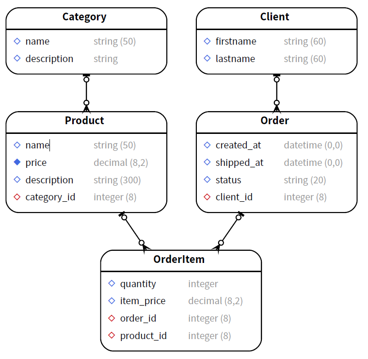

# JSOO (Javascript Orienté Objet)
## Mise en place
Voici un schéma de base de donnée. L'exercice est de le transformer en classes javascript et de créer des objets afin de voir plus en profondeur le fonctionnement de JSOO.

Nous aurons donc 5 classes à créer, une pour chaque table

## Espace de travail
Vous pouvez effecuter cet exercice sur un éditeur de code en ligne : https://playcode.io/ afin de ne pas perdre de temps avec la mise en place d'un environnement.

Vous pouvez utiliser l'éditeur de texte que vous souhaitez. Seul le contenu importe.

## Exercice 1
1. Créez la classe **Client** avec un constructeur
2. Créez un objet **Client**
3. Créez une fonction qui permet d'afficher le contenu de l'objet.
4. Affichez l'objet grâce à la fonction de la classe **Client**

## Exercice 2
1. Créez le reste des classes du MLD
2. Créez un objet par classe
3. Créez une fonction qui permet d'afficher le contenu de chaque objet.
3. Créez les objets qui contiennent des relations étrangère, sans écrire les valeurs en dur.

Référez-vous à la documentation et aux liens afin de réaliser cet exercice.
